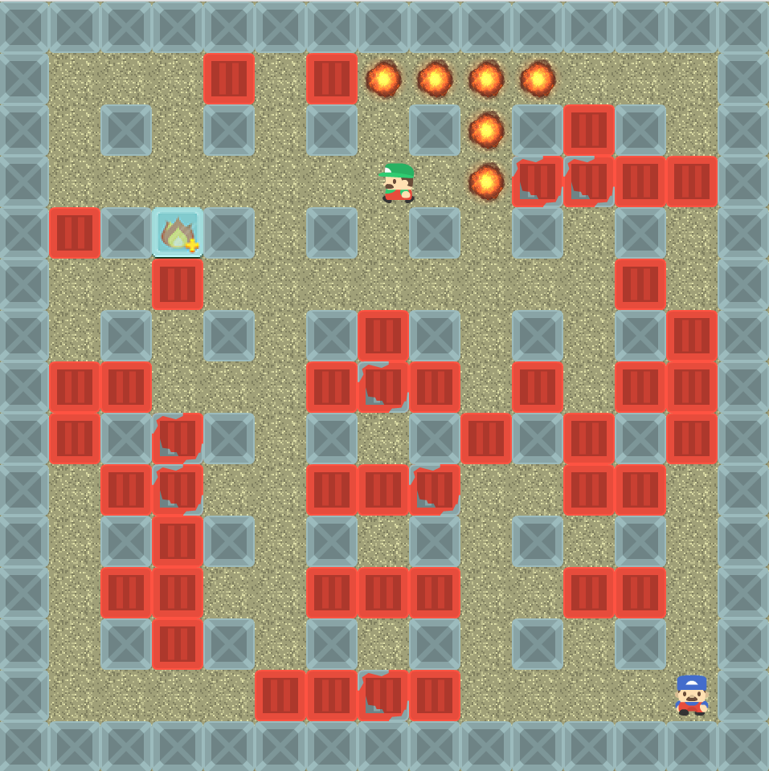

# Bomberman game
## About
It is a [bomberman game](https://en.wikipedia.org/wiki/Bomberman). The main goal of this project is to improve my knowledge of Kotlin lang.

## Data
All data files were downloaded from the following sources, some of them have been modified
### Textures:
<http://kenney.nl>

<https://opengameart.org>
### Sounds:
<http://soundimage.org>

<https://freesound.org>

## How to play:
1. Download [Java](https://java.com/en/download/) (pre-installed on most devices)
2. Download `bomberman.jar` and `data.zip` from latest release
3. Copy a `data` folder from `data.zip` to `bomberman.jar`'s folder
4. Run `bomberman.jar` and select option **Create a server on localhost** or try to connect to another server.
